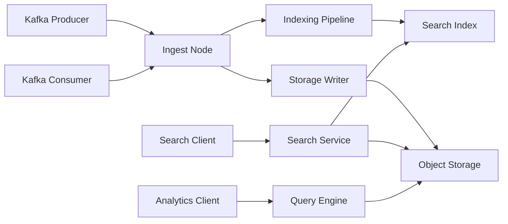

# Chronik Stream Architecture

## Overview

Chronik Stream is a distributed streaming platform that combines the functionality of Apache Kafka with built-in search and analytics capabilities. It's designed to be cloud-native, scalable, and easy to operate.

## Core Components

### 1. Controller Nodes

Controller nodes manage the cluster metadata and coordinate distributed operations:

- **Leader Election**: Uses a simplified Raft consensus protocol for leader election
- **Metadata Management**: Stores topic configurations, partition assignments, and broker information
- **Consumer Group Coordination**: Manages consumer group membership and rebalancing
- **Configuration Management**: Handles dynamic configuration updates

### 2. Ingest Nodes

Ingest nodes handle client connections and data ingestion:

- **Kafka Protocol Support**: Full compatibility with Kafka wire protocol
- **Message Routing**: Routes messages to appropriate storage segments
- **Indexing Pipeline**: Indexes messages for full-text search
- **Replication**: Manages data replication across nodes

### 3. Storage Layer

The storage layer provides durability and scalability:

- **Segment-Based Storage**: Data is organized into immutable segments
- **Object Storage Backend**: Pluggable backends (S3, GCS, Azure, Local)
- **Compression**: Built-in compression support (Snappy, LZ4, Zstd)
- **Tiered Storage**: Hot data in local cache, cold data in object storage

### 4. Search Service

The search service provides full-text search capabilities:

- **Real-time Indexing**: Messages are indexed as they're ingested
- **Distributed Search**: Queries are distributed across all segments
- **Query Language**: Support for complex boolean queries
- **Faceted Search**: Aggregations and analytics on search results

### 5. Query Engine

The query engine handles real-time analytics:

- **Stream Processing**: Windowed aggregations (tumbling, sliding, session)
- **SQL Support**: SQL-like query language for analytics
- **Materialized Views**: Pre-computed aggregations for fast queries
- **Time-Series Operations**: Built-in time-series functions

## Data Flow



## Storage Format

### Segment Structure

```
Segment {
    header: {
        id: UUID,
        topic: String,
        partition: u32,
        base_offset: i64,
        timestamp_range: (i64, i64),
        compression: CompressionType,
        index_offset: u64,
    },
    messages: [Message],
    index: SearchIndex,
    footer: {
        message_count: u32,
        size: u64,
        checksum: u32,
    }
}
```

### Message Format

```
Message {
    offset: i64,
    timestamp: i64,
    key: Option<Vec<u8>>,
    value: Vec<u8>,
    headers: [(String, Vec<u8>)],
}
```

## Networking

### Protocol Support

- **Kafka Wire Protocol**: Full compatibility with Kafka clients
- **HTTP/REST API**: Admin operations and search queries
- **gRPC**: Internal communication between nodes

### Service Discovery

- **Kubernetes**: Uses Kubernetes services for discovery
- **Static Configuration**: Support for static node lists
- **DNS**: DNS-based service discovery

## High Availability

### Data Replication

- **In-Sync Replicas (ISR)**: Maintains a set of in-sync replicas
- **Leader/Follower**: Each partition has a leader and followers
- **Acknowledgments**: Configurable acknowledgment levels (0, 1, all)

### Failure Handling

- **Automatic Failover**: Promotes followers to leaders on failure
- **Data Recovery**: Rebuilds lost replicas from remaining copies
- **Split-Brain Prevention**: Raft consensus prevents split-brain

## Security

### Authentication

- **SASL/PLAIN**: Username/password authentication
- **SASL/SCRAM**: Challenge-response authentication
- **mTLS**: Mutual TLS for client authentication

### Authorization

- **ACLs**: Fine-grained access control lists
- **RBAC**: Role-based access control
- **Multi-tenancy**: Namespace isolation

### Encryption

- **TLS**: Encryption in transit
- **Segment Encryption**: At-rest encryption for segments
- **Key Management**: Integration with KMS providers

## Performance Considerations

### Optimization Strategies

1. **Batching**: Messages are batched for efficient I/O
2. **Zero-Copy**: Uses zero-copy transfers where possible
3. **Memory-Mapped Files**: Efficient file I/O operations
4. **Connection Pooling**: Reuses connections to reduce overhead

### Tuning Parameters

- `segment.size`: Size of individual segments (default: 1GB)
- `batch.size`: Message batch size (default: 16KB)
- `flush.interval.ms`: Time between flushes (default: 100ms)
- `compression.type`: Compression algorithm (default: snappy)

## Deployment Patterns

### Single-Node Development

Suitable for development and testing:
- All components run in a single process
- Uses local file storage
- No replication

### Multi-Node Production

Recommended for production:
- Separate controller, ingest, and search nodes
- Object storage backend
- Replication factor of 3

### Kubernetes Deployment

Cloud-native deployment:
- Custom operator for lifecycle management
- StatefulSets for persistent components
- Horizontal pod autoscaling

## Monitoring and Observability

### Metrics

Exposed via Prometheus endpoint:
- Message throughput
- Storage usage
- Query latency
- Error rates

### Tracing

OpenTelemetry integration:
- Distributed request tracing
- Performance profiling
- Error tracking

### Logging

Structured logging with:
- Log levels (debug, info, warn, error)
- Contextual information
- Log aggregation support