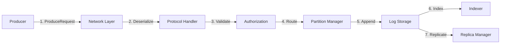
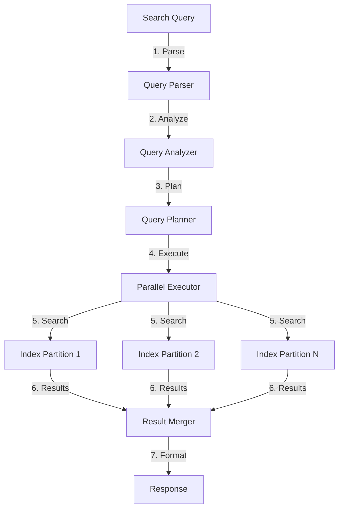

# Data Flow Architecture

This document describes how data flows through Chronik Stream, from producers to consumers and search queries, including all transformations and optimizations along the way.

## Overview

Data in Chronik Stream follows multiple paths:
1. **Write Path**: Producer → Broker → Storage → Replication
2. **Read Path**: Storage → Broker → Consumer
3. **Search Path**: Producer → Indexing → Search Engine → Query Results

## Write Path

### 1. Producer to Broker



#### Detailed Flow

1. **Producer Sends Data**
```rust
// Producer side
let record = ProducerRecord {
    topic: "events",
    partition: Some(0),
    key: Some(b"user-123"),
    value: b"{"action": "click", "timestamp": 1234567890}",
    headers: vec![("source", "web")],
};
producer.send(record).await?;
```

2. **Network Reception**
```rust
// Broker side
async fn handle_connection(mut socket: TcpStream) {
    let mut buffer = BytesMut::with_capacity(4096);
    
    while socket.read_buf(&mut buffer).await? > 0 {
        if let Some(request) = parse_request(&mut buffer)? {
            let response = handle_request(request).await?;
            socket.write_all(&response.to_bytes()).await?;
        }
    }
}
```

3. **Request Processing**
```rust
async fn handle_produce_request(req: ProduceRequest) -> ProduceResponse {
    // Validate ACLs
    authorize(&req.transactional_id, &req.topics)?;
    
    // Process each topic
    let mut responses = HashMap::new();
    for topic_data in req.topics {
        let topic_response = process_topic_produce(topic_data).await?;
        responses.insert(topic_data.name, topic_response);
    }
    
    ProduceResponse {
        responses,
        throttle_time_ms: 0,
    }
}
```

4. **Partition Append**
```rust
async fn append_to_partition(
    partition: &mut Partition,
    records: RecordBatch,
) -> Result<i64> {
    // Assign offsets
    let base_offset = partition.next_offset();
    records.set_base_offset(base_offset);
    
    // Validate
    validate_records(&records)?;
    
    // Append to log
    let append_result = partition.log.append(records).await?;
    
    // Trigger replication
    if partition.is_leader() {
        partition.replica_manager.replicate(append_result).await;
    }
    
    Ok(append_result.last_offset)
}
```

### 2. Storage Operations

#### Log Append Process

```
┌─────────────────────────────────────────┐
│           Active Segment                 │
│                                         │
│  ┌─────────────────────────────────┐   │
│  │    Memory Buffer (4MB)          │   │
│  │  ┌───┬───┬───┬───┬───┬────┐   │   │
│  │  │R1 │R2 │R3 │R4 │R5 │... │   │   │
│  │  └───┴───┴───┴───┴───┴────┘   │   │
│  └──────────┬──────────────────────┘   │
│             │ Flush (when full)         │
│             ▼                           │
│  ┌─────────────────────────────────┐   │
│  │    Segment File (.log)          │   │
│  │  ┌────────────────────────┐     │   │
│  │  │ Compressed Records      │     │   │
│  │  └────────────────────────┘     │   │
│  └─────────────────────────────────┘   │
│                                         │
│  ┌─────────────────────────────────┐   │
│  │    Index Files                  │   │
│  │  ├─ offset.index               │   │
│  │  ├─ timestamp.index            │   │
│  │  └─ search.index               │   │
│  └─────────────────────────────────┘   │
└─────────────────────────────────────────┘
```

#### Write Optimization

```rust
pub struct WriteBuffer {
    buffer: Vec<u8>,
    capacity: usize,
    pending_callbacks: Vec<WriteCallback>,
}

impl WriteBuffer {
    pub async fn append(&mut self, batch: RecordBatch) -> WriteHandle {
        // Add to buffer
        self.buffer.extend_from_slice(&batch.to_bytes());
        
        // Create callback handle
        let (tx, rx) = oneshot::channel();
        self.pending_callbacks.push(WriteCallback {
            offset: batch.last_offset,
            callback: tx,
        });
        
        // Flush if buffer is full
        if self.buffer.len() >= self.capacity {
            self.flush().await;
        }
        
        WriteHandle { receiver: rx }
    }
    
    async fn flush(&mut self) {
        // Write to disk
        let file = self.segment_file.as_mut();
        file.write_all(&self.buffer).await?;
        file.sync_data().await?;
        
        // Notify callbacks
        for callback in self.pending_callbacks.drain(..) {
            callback.callback.send(Ok(callback.offset));
        }
        
        self.buffer.clear();
    }
}
```

### 3. Indexing Pipeline

#### Real-time Indexing

```rust
pub struct IndexingPipeline {
    receiver: mpsc::Receiver<IndexRequest>,
    index_writer: Arc<RwLock<IndexWriter>>,
    batch_size: usize,
}

impl IndexingPipeline {
    pub async fn run(&mut self) {
        let mut batch = Vec::with_capacity(self.batch_size);
        
        loop {
            // Collect batch
            tokio::select! {
                Some(request) = self.receiver.recv() => {
                    batch.push(request);
                    
                    if batch.len() >= self.batch_size {
                        self.index_batch(batch.drain(..).collect()).await;
                    }
                }
                _ = tokio::time::sleep(Duration::from_millis(100)) => {
                    if !batch.is_empty() {
                        self.index_batch(batch.drain(..).collect()).await;
                    }
                }
            }
        }
    }
    
    async fn index_batch(&self, requests: Vec<IndexRequest>) {
        let mut writer = self.index_writer.write().await;
        
        for request in requests {
            let doc = self.create_document(request);
            writer.add_document(doc);
        }
        
        writer.commit().await;
    }
}
```

## Read Path

### 1. Consumer Fetch Flow


#### Fetch Optimization

```rust
pub struct FetchContext {
    min_bytes: i32,
    max_wait_ms: i32,
    max_bytes: i32,
    isolation_level: IsolationLevel,
}

pub async fn handle_fetch_request(
    request: FetchRequest,
    context: FetchContext,
) -> FetchResponse {
    let mut response_data = HashMap::new();
    let mut total_bytes = 0;
    
    // Set up delayed fetch if needed
    let deadline = Instant::now() + Duration::from_millis(context.max_wait_ms as u64);
    
    loop {
        // Try to fetch data
        for topic in &request.topics {
            for partition in &topic.partitions {
                let data = fetch_partition_data(
                    &topic.name,
                    partition.partition,
                    partition.fetch_offset,
                    partition.partition_max_bytes,
                ).await?;
                
                total_bytes += data.records.size_in_bytes();
                response_data.insert((topic.name.clone(), partition.partition), data);
            }
        }
        
        // Check if we have enough data or timeout
        if total_bytes >= context.min_bytes || Instant::now() >= deadline {
            break;
        }
        
        // Wait for more data
        tokio::time::sleep(Duration::from_millis(10)).await;
    }
    
    FetchResponse {
        throttle_time_ms: 0,
        error_code: 0,
        session_id: request.session_id,
        responses: response_data,
    }
}
```

### 2. Read Optimization

#### Page Cache Integration

```rust
pub struct PageCacheManager {
    cache: Arc<Mutex<LruCache<CacheKey, Bytes>>>,
    size_limit: usize,
    current_size: AtomicUsize,
}

impl PageCacheManager {
    pub async fn read_with_cache(
        &self,
        segment: &Segment,
        offset: u64,
        length: usize,
    ) -> io::Result<Bytes> {
        let key = CacheKey {
            segment_id: segment.id(),
            offset,
            length,
        };
        
        // Check cache
        if let Some(data) = self.cache.lock().await.get(&key) {
            return Ok(data.clone());
        }
        
        // Read from disk
        let data = segment.read(offset, length).await?;
        
        // Update cache
        self.update_cache(key, data.clone()).await;
        
        Ok(data)
    }
}
```

#### Sendfile Zero-Copy

```rust
pub async fn send_file_to_socket(
    file: &File,
    socket: &mut TcpStream,
    offset: u64,
    length: u64,
) -> io::Result<u64> {
    #[cfg(target_os = "linux")]
    {
        use tokio::io::unix::AsyncFd;
        
        let file_fd = file.as_raw_fd();
        let socket_fd = socket.as_raw_fd();
        
        let mut bytes_sent = 0;
        let mut current_offset = offset as i64;
        
        while bytes_sent < length {
            let remaining = length - bytes_sent;
            let to_send = std::cmp::min(remaining, 1 << 20); // 1MB chunks
            
            match unsafe {
                libc::sendfile(
                    socket_fd,
                    file_fd,
                    &mut current_offset,
                    to_send as usize,
                )
            } {
                -1 => return Err(io::Error::last_os_error()),
                0 => break,
                n => bytes_sent += n as u64,
            }
        }
        
        Ok(bytes_sent)
    }
    
    #[cfg(not(target_os = "linux"))]
    {
        // Fallback to regular read/write
        let mut buffer = vec![0u8; length as usize];
        file.read_exact_at(&mut buffer, offset).await?;
        socket.write_all(&buffer).await?;
        Ok(length)
    }
}
```

## Search Path

### 1. Query Processing Flow



#### Query Planning

```rust
pub struct QueryPlanner {
    index_manager: Arc<IndexManager>,
    statistics: Arc<IndexStatistics>,
}

impl QueryPlanner {
    pub async fn plan_query(&self, query: &SearchQuery) -> QueryPlan {
        // Analyze query complexity
        let complexity = self.analyze_complexity(query);
        
        // Determine partitions to search
        let partitions = self.select_partitions(query).await;
        
        // Create execution plan
        QueryPlan {
            query: self.optimize_query(query),
            partitions,
            parallelism: self.calculate_parallelism(complexity),
            timeout: Duration::from_millis(query.timeout_ms),
            early_termination: query.limit.is_some(),
        }
    }
    
    fn optimize_query(&self, query: &SearchQuery) -> OptimizedQuery {
        // Rewrite query for better performance
        // - Convert phrase queries to term queries when possible
        // - Push down filters
        // - Optimize boolean clauses
        // - Add query cache hints
    }
}
```

### 2. Distributed Search

```rust
pub struct DistributedSearcher {
    searchers: HashMap<i32, PartitionSearcher>,
    executor: ThreadPool,
}

impl DistributedSearcher {
    pub async fn search(&self, plan: QueryPlan) -> SearchResults {
        // Execute searches in parallel
        let futures: Vec<_> = plan.partitions
            .iter()
            .map(|partition_id| {
                let searcher = self.searchers.get(partition_id).unwrap();
                let query = plan.query.clone();
                
                tokio::spawn(async move {
                    searcher.search(query).await
                })
            })
            .collect();
        
        // Collect results
        let mut all_results = Vec::new();
        for future in futures {
            match future.await {
                Ok(Ok(results)) => all_results.push(results),
                Ok(Err(e)) => log::error!("Search error: {}", e),
                Err(e) => log::error!("Task error: {}", e),
            }
        }
        
        // Merge results
        self.merge_results(all_results, plan.query.limit)
    }
    
    fn merge_results(&self, results: Vec<PartitionResults>, limit: Option<usize>) -> SearchResults {
        // Merge by score
        let mut merged = BinaryHeap::new();
        
        for partition_results in results {
            for hit in partition_results.hits {
                merged.push(ScoredDocument {
                    score: hit.score,
                    document: hit.document,
                });
            }
        }
        
        // Apply limit
        let hits: Vec<_> = merged
            .into_sorted_vec()
            .into_iter()
            .take(limit.unwrap_or(100))
            .collect();
        
        SearchResults {
            hits,
            total_hits: results.iter().map(|r| r.total_hits).sum(),
            took_ms: results.iter().map(|r| r.took_ms).max().unwrap_or(0),
        }
    }
}
```

## Data Transformation Pipeline

### 1. Compression

```rust
pub enum CompressionType {
    None,
    Gzip,
    Snappy,
    Lz4,
    Zstd,
}

pub struct CompressionPipeline {
    compression_type: CompressionType,
    level: i32,
}

impl CompressionPipeline {
    pub fn compress(&self, data: &[u8]) -> Vec<u8> {
        match self.compression_type {
            CompressionType::None => data.to_vec(),
            CompressionType::Snappy => {
                let mut encoder = snap::raw::Encoder::new();
                encoder.compress_vec(data).unwrap()
            },
            CompressionType::Lz4 => {
                lz4::block::compress(data, None, true).unwrap()
            },
            CompressionType::Zstd => {
                zstd::encode_all(data, self.level).unwrap()
            },
            // ... other types
        }
    }
}
```

### 2. Serialization

```rust
pub trait Serializer {
    fn serialize<T: Serialize>(&self, value: &T) -> Result<Vec<u8>>;
    fn deserialize<T: DeserializeOwned>(&self, data: &[u8]) -> Result<T>;
}

pub struct MessagePackSerializer;

impl Serializer for MessagePackSerializer {
    fn serialize<T: Serialize>(&self, value: &T) -> Result<Vec<u8>> {
        rmp_serde::to_vec(value).map_err(Into::into)
    }
    
    fn deserialize<T: DeserializeOwned>(&self, data: &[u8]) -> Result<T> {
        rmp_serde::from_slice(data).map_err(Into::into)
    }
}
```

## Performance Considerations

### 1. Batching

- **Producer Batching**: Accumulate records before sending
- **Storage Batching**: Group writes for better I/O
- **Index Batching**: Batch document additions
- **Network Batching**: Coalesce small messages

### 2. Pipelining

```rust
pub struct Pipeline<T> {
    stages: Vec<Box<dyn PipelineStage<T>>>,
}

#[async_trait]
pub trait PipelineStage<T>: Send + Sync {
    async fn process(&self, input: T) -> Result<T>;
}

impl<T> Pipeline<T> {
    pub async fn execute(&self, input: T) -> Result<T> {
        let mut current = input;
        
        for stage in &self.stages {
            current = stage.process(current).await?;
        }
        
        Ok(current)
    }
}
```

### 3. Caching Strategy

```yaml
Cache Hierarchy:
  L1 - CPU Cache:
    - Hot metadata
    - Recent offsets
    
  L2 - Application Cache:
    - Index summaries  
    - Segment metadata
    - Consumer offsets
    
  L3 - Page Cache:
    - Recent log segments
    - Hot index files
    
  L4 - Disk:
    - All persistent data
```

## Monitoring Data Flow

### Metrics Collection

```rust
pub struct DataFlowMetrics {
    produce_rate: Counter,
    consume_rate: Counter,
    index_rate: Counter,
    search_rate: Counter,
    
    produce_latency: Histogram,
    consume_latency: Histogram,
    index_latency: Histogram,
    search_latency: Histogram,
    
    bytes_in: Counter,
    bytes_out: Counter,
}

impl DataFlowMetrics {
    pub fn record_produce(&self, bytes: usize, duration: Duration) {
        self.produce_rate.inc();
        self.bytes_in.inc_by(bytes as u64);
        self.produce_latency.observe(duration.as_secs_f64());
    }
}
```

## Next Steps

- Learn about [Storage Architecture](storage-architecture.md)
- Explore [Search Architecture](search-architecture.md)
- Understand [Replication & Fault Tolerance](replication.md)
- Review [Performance Tuning](../deployment/performance-tuning.md)