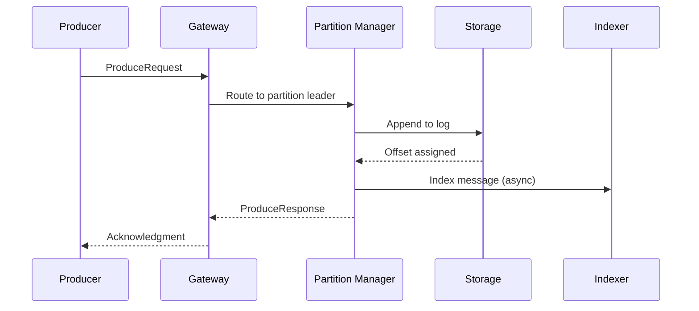
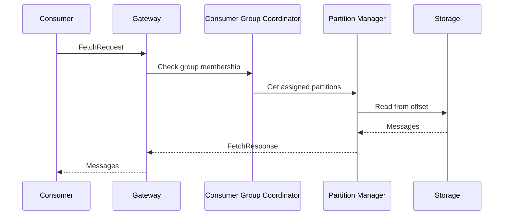
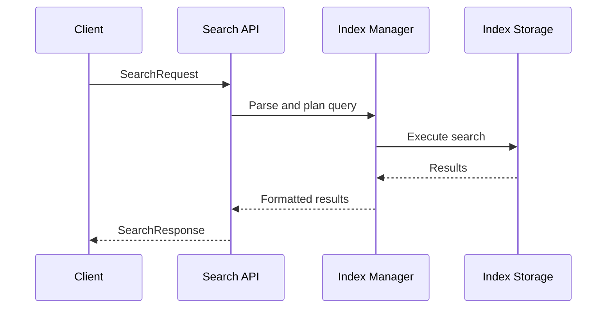

# System Overview

## Introduction

Chronik Stream is designed as a distributed, fault-tolerant streaming platform that seamlessly integrates real-time search capabilities. This document provides a comprehensive overview of the system architecture, design decisions, and how components work together.

## Core Architecture

### System Components

```
┌──────────────────────────────────────────────────────────────────┐
│                          Client Layer                              │
│  ┌──────────────┐  ┌──────────────┐  ┌─────────────────────┐    │
│  │   Producers  │  │  Consumers   │  │  Search Clients     │    │
│  └──────┬───────┘  └──────┬───────┘  └─────────┬───────────┘    │
└─────────┼──────────────────┼────────────────────┼─────────────────┘
          │                  │                    │
          ▼                  ▼                    ▼
┌──────────────────────────────────────────────────────────────────┐
│                     API Gateway Layer                             │
│  ┌─────────────────┐  ┌──────────────────┐  ┌────────────────┐  │
│  │ Kafka Protocol  │  │  Consumer Group   │  │  Search API    │  │
│  │    Handler      │  │   Coordinator     │  │   Handler      │  │
│  └────────┬────────┘  └────────┬─────────┘  └───────┬────────┘  │
└───────────┼────────────────────┼─────────────────────┼───────────┘
            │                    │                     │
            ▼                    ▼                     ▼
┌──────────────────────────────────────────────────────────────────┐
│                      Core Services Layer                          │
│  ┌─────────────────┐  ┌──────────────────┐  ┌────────────────┐  │
│  │  Partition      │  │   Replication     │  │  Index Manager │  │
│  │   Manager       │  │     Manager       │  │                │  │
│  └────────┬────────┘  └────────┬─────────┘  └───────┬────────┘  │
└───────────┼────────────────────┼─────────────────────┼───────────┘
            │                    │                     │
            ▼                    ▼                     ▼
┌──────────────────────────────────────────────────────────────────┐
│                      Storage Layer                                │
│  ┌─────────────────┐  ┌──────────────────┐  ┌────────────────┐  │
│  │   Log Storage   │  │  Index Storage    │  │ Metadata Store │  │
│  │   (Segments)    │  │   (Tantivy)       │  │   (File-based) │  │
│  └─────────────────┘  └──────────────────┘  └────────────────┘  │
└──────────────────────────────────────────────────────────────────┘
```

### Component Responsibilities

#### 1. Client Layer
- **Producers**: Send messages to topics
- **Consumers**: Read messages from topics
- **Search Clients**: Execute search queries

#### 2. API Gateway Layer
- **Kafka Protocol Handler**: Implements Kafka wire protocol
- **Consumer Group Coordinator**: Manages consumer groups and rebalancing
- **Search API Handler**: Processes search requests and returns results

#### 3. Core Services Layer
- **Partition Manager**: Manages topic partitions and assignments
- **Replication Manager**: Handles data replication and consistency
- **Index Manager**: Coordinates real-time indexing and search operations

#### 4. Storage Layer
- **Log Storage**: Persistent message storage using log segments
- **Index Storage**: Search indices managed by Tantivy
- **Metadata Store**: Cluster metadata, configurations, and offsets

## Design Principles

### 1. Separation of Concerns

Each component has a well-defined responsibility:
- Protocol handling is separate from storage
- Search indexing is decoupled from message flow
- Metadata management is independent

### 2. Asynchronous Processing

All I/O operations are asynchronous:
- Non-blocking network I/O using Tokio
- Async disk operations for better throughput
- Parallel processing of independent operations

### 3. Zero-Copy Data Path

Messages flow through the system with minimal copying:
```
Producer → Network Buffer → Storage → Network Buffer → Consumer
                   ↓
               Index Builder (async, zero-copy reference)
```

### 4. Distributed Consensus

- Uses Raft consensus for metadata operations
- Leader election for partition management
- Consistent view of cluster state

## Data Model

### Topics and Partitions

```
Topic: user-events
├── Partition 0
│   ├── Segment 00000000.log
│   ├── Segment 00000001.log
│   └── Active Segment
├── Partition 1
│   ├── Segment 00000000.log
│   └── Active Segment
└── Partition 2
    ├── Segment 00000000.log
    ├── Segment 00000001.log
    └── Active Segment
```

### Message Format

```rust
struct Message {
    offset: i64,
    timestamp: i64,
    key: Option<Vec<u8>>,
    value: Vec<u8>,
    headers: Vec<Header>,
    crc: u32,
}

struct Header {
    key: String,
    value: Vec<u8>,
}
```

### Index Structure

Each partition maintains its own search index:
```
Partition Index
├── Terms Dictionary
├── Postings Lists
├── Stored Fields
├── Fast Fields (columnar)
└── Positions
```

## Request Flow

### Producer Request Flow



### Consumer Request Flow



### Search Request Flow



## Scalability Model

### Horizontal Scaling

1. **Broker Scaling**
   - Add brokers to increase throughput
   - Automatic partition rebalancing
   - Linear scalability up to 100s of nodes

2. **Storage Scaling**
   - Partitions distributed across brokers
   - Each partition independently scalable
   - Tiered storage for cold data

3. **Search Scaling**
   - Distributed search across partitions
   - Query parallelization
   - Result aggregation at coordinator

### Vertical Scaling

1. **CPU Optimization**
   - Multi-core utilization
   - SIMD instructions for compression
   - Parallel index building

2. **Memory Optimization**
   - Page cache for hot data
   - In-memory indices for fast search
   - Configurable cache sizes

3. **I/O Optimization**
   - Sequential writes for logs
   - Batch operations
   - Direct I/O for large transfers

## Fault Tolerance

### Failure Scenarios

1. **Broker Failure**
   - Automatic failover to replicas
   - Leader election within 5 seconds
   - No data loss with proper replication

2. **Network Partition**
   - Split-brain prevention
   - Minority partitions go read-only
   - Automatic recovery on heal

3. **Disk Failure**
   - Redirect traffic to replicas
   - Background re-replication
   - Configurable failure thresholds

### Data Durability

- **Replication Factor**: Configurable per topic
- **Min In-Sync Replicas**: Ensures write durability
- **Acknowledgment Levels**: Producer can choose durability vs latency

## Performance Optimizations

### 1. Batch Processing
- Producers batch messages
- Consumers fetch in batches
- Index updates batched

### 2. Compression
- Multiple algorithms supported
- Compression at producer or broker
- Transparent decompression

### 3. Caching
- Operating system page cache
- Application-level caching
- Distributed cache for hot data

### 4. Network Optimization
- TCP no-delay for low latency
- Larger socket buffers
- Connection pooling

## Monitoring and Observability

### Metrics

- **Throughput Metrics**
  - Messages/second (in/out)
  - Bytes/second (in/out)
  - Request rate

- **Latency Metrics**
  - Producer latency (p50, p95, p99)
  - Consumer lag
  - Search query time

- **Resource Metrics**
  - CPU utilization
  - Memory usage
  - Disk I/O
  - Network I/O

### Health Checks

```yaml
/health
  /broker
    - storage: OK
    - replication: OK
    - connections: 245/1000
  /search
    - indices: HEALTHY
    - query_rate: 1250/s
  /cluster
    - nodes: 5/5
    - partitions: 150
    - under_replicated: 0
```

## Security Model

### Authentication
- SASL/PLAIN
- SASL/SCRAM
- mTLS
- OAuth 2.0 (pluggable)

### Authorization
- ACLs per resource
- Role-based access control
- Topic-level permissions
- Operation-level control

### Encryption
- TLS for client connections
- TLS for inter-broker communication
- At-rest encryption (optional)

## Configuration Management

### Dynamic Configuration
- Runtime configuration updates
- No restart required
- Propagated via metadata store

### Static Configuration
- Startup parameters
- Hardware-specific settings
- Security configurations

## Next Steps

- Learn about [Component Architecture](component-architecture.md)
- Understand [Data Flow](data-flow.md) in detail
- Explore [Storage Architecture](storage-architecture.md)
- Review [Search Architecture](search-architecture.md)